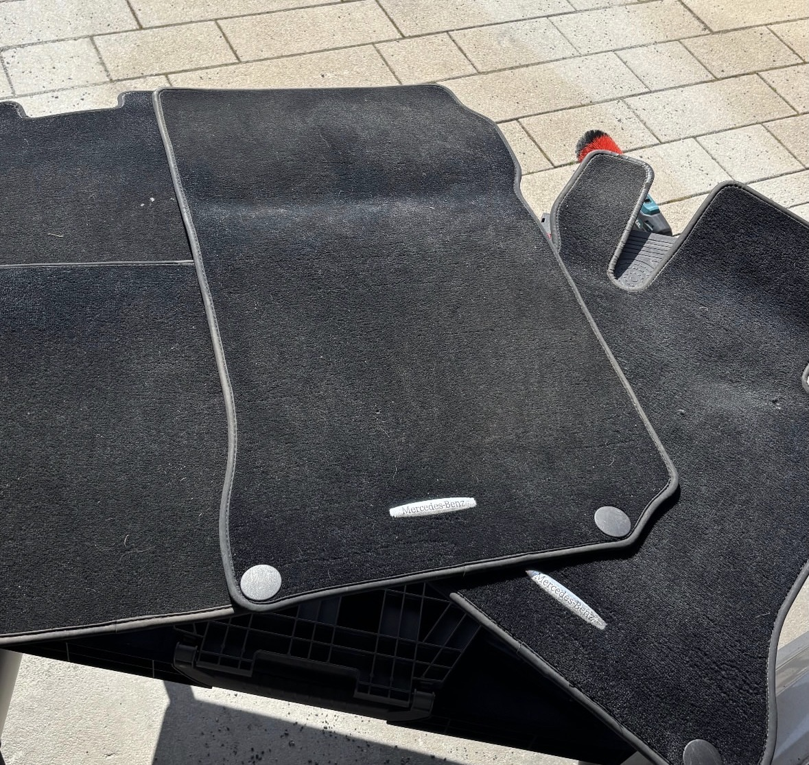
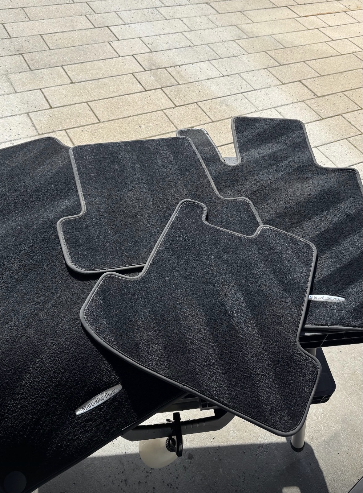
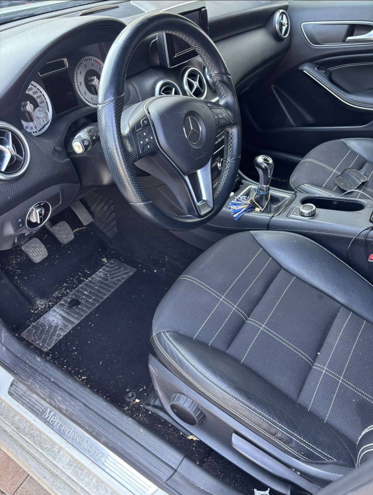
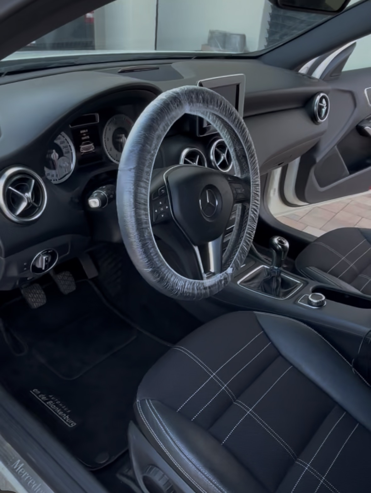

[index .html](https://github.com/user-attachments/files/29016709/index.html)
<!DOCTYPE html>
<html lang="de">
<head>
    <meta charset="UTF-8">
    <meta name="viewport" content="width=device-width, initial-scale=1.0">
    <title>Duo_Detailing0 | Professionelle Fahrzeugaufbereitung</title>
    
</head>
<body>

    <header>
        
DUO_DETAILING0

    </header>

    <section class="hero">
        <h1>MAXIMALE PERFEKTION FÜR IHR FAHRZEUG</h1>
        
Professionelle Innenraumreinigung, Lederpflege & Werterhalt auf höchstem Niveau.

          
        <a href="#kontakt" class="btn">Jetzt Anfrage senden</a>
    </section>

    <section class="section">
        <h2 class="section-title">Unsere Detailing-Services</h2>
        
Porentiefe Sauberkeit und exklusive Pflege für Ihr Fahrzeug.

        
        

            

                <h3>Professionelle Innenraumreinigung</h3>
                
Tiefenreinigung von Polstern, Teppichen und Dachhimmel. Befreiung von hartnäckigem Schmutz, Gerüchen und Flecken für ein absolutes Neuwagengefühl.

            

            
            

                <h3>Exklusive Lederpflege</h3>
                
Schonende Reinigung und Tiefenpflege von Ledersitzen und -elementen. Schützt vor Rissen, spröden Stellen und sorgt für langanhaltende Geschmeidigkeit.

            

            

                <h3>Außenreinigung & Handwäsche Demnächst</h3>
                
Schonende und gründliche Lackreinigung von Hand, um feine Kratzer zu vermeiden und den groben Schmutz perfekt zu lösen.

            

            

                <h3>Polituren & Lackkorrektur Demnächst</h3>
                
Professionelle Defektkorrektur zur Beseitigung von Kratzern und Hologrammen. Für maximalen Tiefenglanz und eine perfekte Spiegelung.

            

        

    </section>

    <section class="section">
        

            <h2>Folgen Sie der Verwandlung</h2>
            
Auf unseren Social-Media-Kanälen nehmen wir Sie täglich mit. Sehen Sie spektakuläre Vorher-/Nachher-Videos und exklusive Einblicke in unsere Arbeit!

            

                <a href="https://www.tiktok.com/@diamond_cleaning_car" target="_blank">TikTok (@diamond_cleaning_car) ↗</a>
                <a href="https://www.instagram.com/Duo.etailing" target="_blank">Instagram (@Duo.etailing) ↗</a>
            

        

    </section>

    <section id="kontakt" class="section">
        <h2 class="section-title">Termin oder Angebot anfragen</h2>
        
Schreiben Sie uns oder rufen Sie an, um den Wert Ihres Fahrzeugs zu erhalten.

        
        

            
📧 info Johannesludtke72@gmail.com

            
📞 +49 1727522401

            
📍 

             
            
(Hier kannst du später noch deine echten Kontaktdaten eintragen)

        

    </section>

    <footer style="background-color: #121212; padding: 40px 20px; text-align: left; border-top: 4px solid #ff3333; color: #ffffff;">
        
&copy; 2026 Duo_Detailing0. Alle Rechte vorbehalten.

        
        

<section id="galerie" style="padding: 60px 20px; background-color: #121212; text-align: center;">
        <h2 style="color: #ffffff; font-size: 2.5rem; margin-bottom: 10px; text-transform: uppercase;">Unsere Ergebnisse</h2>
        
Überzeuge dich selbst von unserer Qualitätsarbeit (Vorher / Nachher).

        
        

            
            

                <h3 style="color: #fff; margin-top: 0; font-size: 1.1rem; margin-bottom: 15px;">Projekt 1: Innenraum-Aufbereitung</h3>
                

                    

                  

         

       <section id="galerie" style="padding: 60px 20px; background-color: #121212; text-align: center;">
        <h2 style="color: #ffffff; font-size: 2.5rem; margin-bottom: 10px; text-transform: uppercase;">Unsere Ergebnisse</h2>
        
Überzeuge dich selbst von unserer Qualitätsarbeit (Vorher / Nachher).

        
        

            
            

                <h3 style="color: #fff; margin-top: 0; font-size: 1.1rem; margin-bottom: 15px;">Projekt 1: Innenreinigung</h3>
                

                    

                        
                        
Vorher

                    

                    

                        
                        
Nachher

                    

                

            

            

                <h3 style="color: #fff; margin-top: 0; font-size: 1.1rem; margin-bottom: 15px;">Projekt 2: Tiefenreinigung</h3>
                

                    

                        
                        
Vorher

                    

                    

                        

                        
                        
Nachher

                    
               

            

            

                <h3 style="color: #fff; margin-top: 0; font-size: 1.1rem; margin-bottom: 15px;">Projekt 3: Detail-Aufbereitung</h3>
                

                    

                        
                        
Vorher

                    

                    

                        
                        
Nachher

                    

                

            

        

    </section> </section><section id="preise" style="padding: 60px 20px; background-color: #1a1a1a; text-align: center;">
        <h2 style="color: #ffffff; font-size: 2.5rem; margin-bottom: 10px; text-transform: uppercase;">Unsere Pakete & Preise</h2>
        
Alle Preise sind Richtpreise und können je nach Fahrzeuggröße und Verschmutzungsgrad variieren.

        
        

            
            

                <h3 style="margin-top: 0; color: #fff;">Basic Paket</h3>
                
ab 70 €

                <ul style="list-style: none; padding: 0; line-height: 2;">
                    <li>✓ Gründliches Aussaugen</li>
                    <li>✓ Oberflächenreinigung (grob)</li>
                    <li>✓ Reinigung der Fußmatten (grob)</li>
                    <li>✓ Reinigung der Türen</li>
                    <li>✓ Fensterreinigung</li>
                </ul>
            

            

                <h3 style="margin-top: 0; color: #fff;">Duo-Standard Paket</h3>
                
ab 90 €

                <ul style="list-style: none; padding: 0; line-height: 2;">
                    <li>✓ Gründliches Aussaugen</li>
                    <li>✓ Intensive Oberflächenreinigung</li>
                    <li>✓ Reinigung der Fußmatten</li>
                    <li>✓ Reinigung der Einstiegsleisten</li>
                    <li>✓ Reinigung der Türen</li>
                    <li>✓ Leder- oder Polstersitzreinigung</li>
                    <li>✓ Spiegel- & Fensterreinigung</li>
                </ul>
            

            

                <h3 style="margin-top: 0; color: #fff;">Premium Paket</h3>
                
ab 119 €

                <ul style="list-style: none; padding: 0; line-height: 2;">
                    <li>✓ Gründliches Aussaugen</li>
                    <li>✓ Intensive Oberflächenreinigung</li>
                    <li>✓ Intensive Fußmattenreinigung</li>
                    <li>✓ Einstiegsleisten & Türpfalzen</li>
                    <li>✓ Reinigung der Türen</li>
                    <li>✓ Intensive Leder- / Polsterreinigung</li>
                    <li>✓ Spiegel- & Fensterreinigung</li>
                </ul>
            

        

        

            <h3 style="color: #ff3333; margin-top: 0; text-transform: uppercase; font-size: 1.2rem;">Zusatzleistungen & Sonderaufwand</h3>
            
Für besondere Verschmutzungen oder spezielle Wünsche berechnen wir folgende Aufpreise:

            

                
• Tierhaar-Entfernung: + 15 €

                
• Hartnäckige Flecken: + 5 €

                
• Fahrzeughimmel-Reinigung: ab 70 €

                
• Weitere Extras: nach Aufwand

            

        

        

        

            <h3 style="color: #ff3333; margin-bottom: 10px;">Impressum</h3>
            
<strong>Angaben gemäß § 5 TMG:</strong>

            
[Johannes] [Lüdtke] 
            Duo_Detailing0 
            [Straße der Freundschaft 5] 
            [01796 Pirna]

            
<strong>Kontakt:</strong> 
            Telefon: [+491727522401] 
            E-Mail: [Johannesludtke72@gmail.com]

            
<strong>Verantwortlich für den Inhalt nach § 55 Abs. 2 RStV:</strong> 
            [Johannes] [Lüdtke] 
            [Straße der Freundschaft 5] 
            [01796 Pirna]

        

        

            <h3 style="color: #ff3333; margin-bottom: 10px;">Datenschutzerklärung</h3>
            
<strong>Allgemeine Hinweise</strong> 
            Die folgenden Hinweise geben einen einfachen Überblick darüber, was mit Ihren personenbezogenen Daten passiert, wenn Sie diese Website besuchen.

            
            
<strong>Datenerfassung auf dieser Website</strong> 
            Die Datenverarbeitung auf dieser Website erfolgt durch den Websitebetreiber (Kontaktdaten siehe Impressum). Ihre Daten werden zum einen dadurch erhoben, dass Sie uns diese mitteilen. Hierbei handelt es sich um die Daten, die Sie in das Kontaktformular eingeben (Name, E-Mail-Adresse und ggf. Ihre Nachricht). Diese Daten nutzen wir ausschließlich, um Ihre Anfrage zu beantworten.

            
            
<strong>Rechte des Nutzers</strong> 
            Sie haben jederzeit das Recht, unentgeltlich Auskunft über Herkunft, Empfänger und Zweck Ihrer gespeicherten personenbezogenen Daten zu erhalten. Sie haben außerdem ein Recht, die Berichtigung oder Löschung dieser Daten zu verlangen. Bei Fragen hierzu können Sie sich jederzeit unter der im Impressum angegebenen Adresse an uns wenden.

            
            
<strong>Externe Links (Social Media)</strong> 
            Auf unserer Website sind Links zu unseren Social-Media-Kanälen (Instagram, TikTok) eingebunden. Wenn Sie auf diese Links klicken, werden Sie auf die Seiten der jeweiligen Anbieter weitergeleitet. Erst ab diesem Moment werden Daten an die Anbieter übertragen.

        

  
            

        

   
